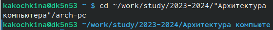
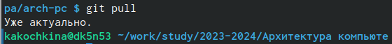
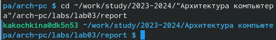
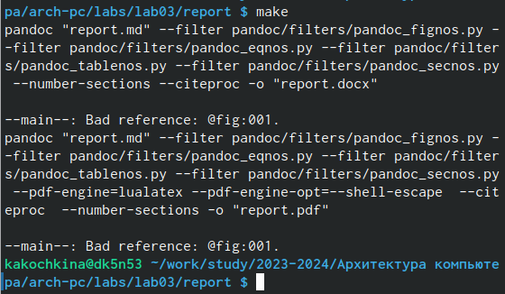
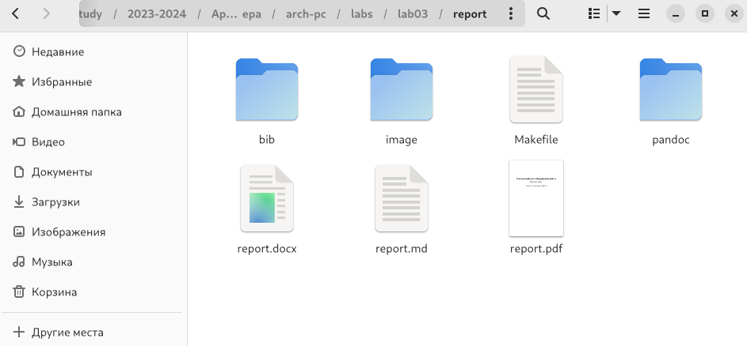
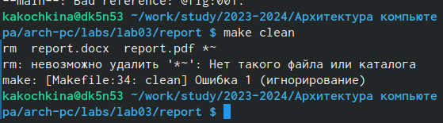
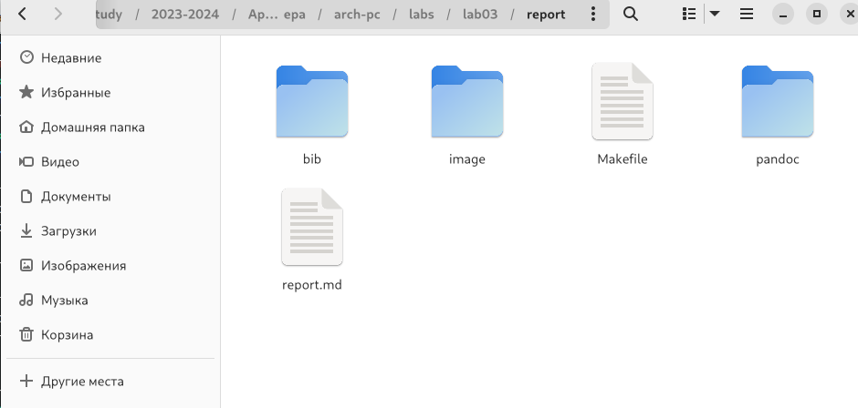
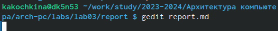
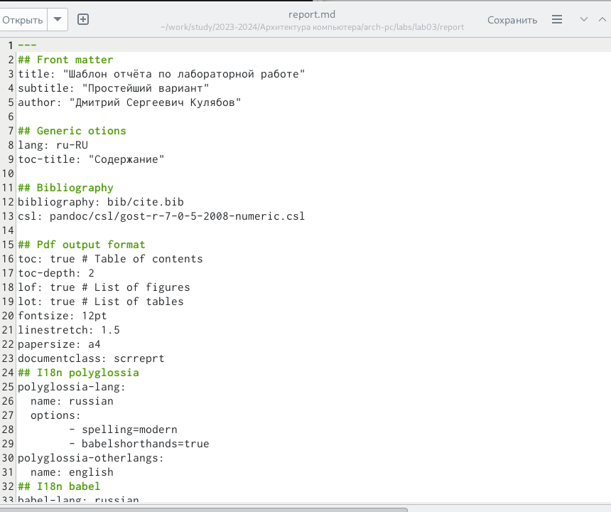
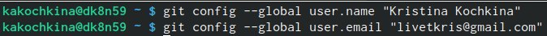

---
## Front matter
title: "Отчёт по лабораторной работе 3"
subtitle: "Язык разметки Markdown"
author: "Кочкина Кристина Андреевна НММбд-02-23"

## Generic otions
lang: ru-RU
toc-title: "Содержание"

## Bibliography
bibliography: bib/cite.bib
csl: pandoc/csl/gost-r-7-0-5-2008-numeric.csl

## Pdf output format
toc: true # Table of contents
toc-depth: 2
lof: true # List of figures
lot: true # List of tables
fontsize: 12pt
linestretch: 1.5
papersize: a4
documentclass: scrreprt
## I18n polyglossia
polyglossia-lang:
  name: russian
  options:
	- spelling=modern
	- babelshorthands=true
polyglossia-otherlangs:
  name: english
## I18n babel
babel-lang: russian
babel-otherlangs: english
## Fonts
mainfont: PT Serif
romanfont: PT Serif
sansfont: PT Sans
monofont: PT Mono
mainfontoptions: Ligatures=TeX
romanfontoptions: Ligatures=TeX
sansfontoptions: Ligatures=TeX,Scale=MatchLowercase
monofontoptions: Scale=MatchLowercase,Scale=0.9
## Biblatex
biblatex: true
biblio-style: "gost-numeric"
biblatexoptions:
  - parentracker=true
  - backend=biber
  - hyperref=auto
  - language=auto
  - autolang=other*
  - citestyle=gost-numeric
## Pandoc-crossref LaTeX customization
figureTitle: "Рис."
tableTitle: "Таблица"
listingTitle: "Листинг"
lotTitle: "Список таблиц"
lolTitle: "Листинги"
## Misc options
indent: true
header-includes:
  - \usepackage{indentfirst}
  - \usepackage{float} # keep figures where there are in the text
  - \floatplacement{figure}{H} # keep figures where there are in the text
---

# Цель работы

Целью работы является ознакомление с возможностями разметки Markdown и оформление в ней лабораторную работу №2.

# Задание

Сделать отчет по лабораторной работе №2 в формате Markdown и загрузить на github.

# Теоретическое введение

Базовые сведения о Markdown

Чтобы задать для текста курсивное начертание, заключите его в одинарные звездочки:
This text is *italic*.

Оформление формул в Markdown

Внутритекстовые формулы делаются аналогично формулам LaTeX. 

Оформление изображеий в Markdown

В Markdown вставить изображение в документ можно с помощью непосредственного
указания адреса изображения.

Обработка файлов в формате Markdown

Преобразовать файл README.md можно следующим образом:

pandoc README.md -o README.pdf

# Выполнение лабораторной работы
 Открыла терминал.
 
 Перешла в каталог курса (рис. 1).

{#fig:1 width=70%}

Обновила локальный репозиторий (рис. 2).

{#fig:2 width=70%}

Перешла в каталог с шаблоном отчёта (рис.3).

{#fig:003 width=70%}

Проводим компиляцию шаблона (рис. 4).

{#fig:004 width=70%}

Проверила корректность полученных файлов (рис. 5).

{#fig:005 width=70%}

Удаляю недавно созданные файлы (рис. 6).

{#fig:006 width=70%}

Проверяю, удалились ли файлы (рис. 7).

{#fig:007 width=70%}

Открываю файл report.md в текстовом редакторе (рис. 8).

{#fig:008 width=70%}

Изучаю данный файл и приступаю к его оформлению для лабораторной работы (рис. 9).

{#fig:009 width=70%}

#Заполнение отчёта по лабораторной работе №2

Настраиваем github

Создаю учётную запись на github и заполняю
основные данные, на рисунке 10 мы видим, что
аккаунт создан.

{#fig:010 width=70%}

Базовая настройка git

Сначала делаю базовую конфигурацию git. В
терминале ввожу следующие команды, указав своё
имя и email которые были привязаны к репозиторию
(рис 11).

{#fig:011 width=70%}

Настраиваю utf-8 в выводе сообщений git (рис 12).

{#fig:012 width=70%}

Задаю имя “master” для начальной ветки (рис 13).

"){#fig:013 width=70%}

Проверяю правильность выполнения работы на самом github
(рис 14).

{#fig:028 width=70%}

# Выводы

Освоила процедуру оформления отчётов с помщью легковесного языка разметки Markdown.

# Список литературы{.unnumbered}

::: {#refs}
:::
