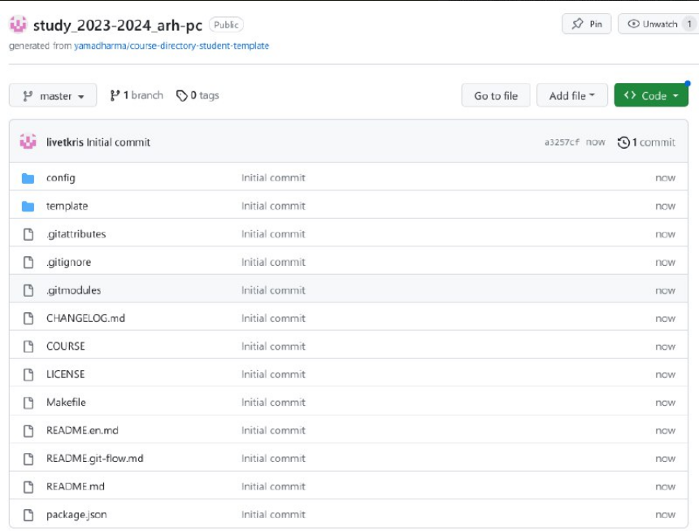
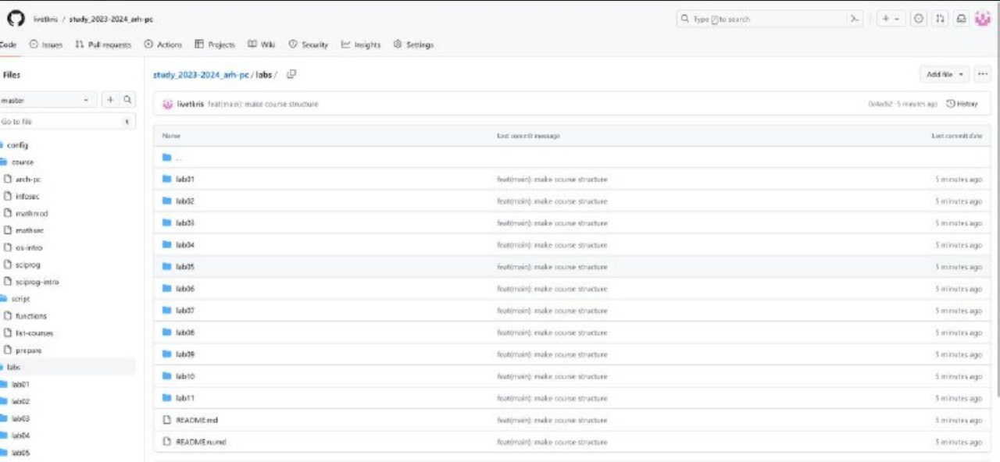

---
## Front matter
title: "Отчёт по лабораторной работе 3"
subtitle: "Язык разметки Markdown"
author: "Кочкина Кристина Андреевна НММбд-02-23"

## Generic otions
lang: ru-RU
toc-title: "Содержание"

## Bibliography
bibliography: bib/cite.bib
csl: pandoc/csl/gost-r-7-0-5-2008-numeric.csl

## Pdf output format
toc: true # Table of contents
toc-depth: 2
lof: true # List of figures
fontsize: 12pt
linestretch: 1.5
papersize: a4
documentclass: scrreprt
## I18n polyglossia
polyglossia-lang:
  name: russian
  options:
	- spelling=modern
	- babelshorthands=true
polyglossia-otherlangs:
  name: english
## I18n babel
babel-lang: russian
babel-otherlangs: english
## Fonts
mainfont: PT Serif
romanfont: PT Serif
sansfont: PT Sans
monofont: PT Mono
mainfontoptions: Ligatures=TeX
romanfontoptions: Ligatures=TeX
sansfontoptions: Ligatures=TeX,Scale=MatchLowercase
monofontoptions: Scale=MatchLowercase,Scale=0.9
## Biblatex
biblatex: true
biblio-style: "gost-numeric"
biblatexoptions:
  - parentracker=true
  - backend=biber
  - hyperref=auto
  - language=auto
  - autolang=other*
  - citestyle=gost-numeric
## Pandoc-crossref LaTeX customization
figureTitle: "Рис."
listingTitle: "Листинг"
lotTitle: "Список таблиц"
lolTitle: "Листинги"
## Misc options
indent: true
header-includes:
  - \usepackage{indentfirst}
  - \usepackage{float} # keep figures where there are in the text
  - \floatplacement{figure}{H} # keep figures where there are in the text
---

# Цель работы

Целью работы является ознакомление с возможностями разметки Markdown и оформление в ней лабораторную работу №2.

# Задание

Сделать отчет по лабораторной работе №2 в формате Markdown и загрузить на github.

# Теоретическое введение

Базовые сведения о Markdown

Чтобы задать для текста курсивное начертание, заключите его в одинарные звездочки:
This text is *italic*.

Оформление формул в Markdown

Внутритекстовые формулы делаются аналогично формулам LaTeX. 

Оформление изображеий в Markdown

В Markdown вставить изображение в документ можно с помощью непосредственного
указания адреса изображения.

Обработка файлов в формате Markdown

Преобразовать файл README.md можно следующим образом:

pandoc README.md -o README.pdf

# Выполнение лабораторной работы

 Открыла терминал.
 
 Перешла в каталог курса (рис. 4.1).

{#fig:1 width=70%}

Обновила локальный репозиторий (рис. 4.2).

{#fig:2 width=70%}

Перешла в каталог с шаблоном отчёта (рис.4.3).

{#fig:003 width=70%}

Проводим компиляцию шаблона (рис. 4.4).

{#fig:004 width=70%}

Проверила корректность полученных файлов (рис. 4.5).

{#fig:005 width=70%}

Удаляю недавно созданные файлы (рис. 4.6).

{#fig:006 width=70%}

Проверяю, удалились ли файлы (рис. 4.7).

{#fig:007 width=70%}

Открываю файл report.md в текстовом редакторе (рис. 4.8).

{#fig:008 width=70%}

Изучаю данный файл и приступаю к его оформлению для лабораторной работы (рис. 4.9).

{#fig:009 width=70%}

# Заполнение отчёта по лабораторной работе №2

Настраиваем github

Создаю учётную запись на github и заполняю
основные данные, на рисунке 5.1 мы видим, что
аккаунт создан.

{#fig:010 width=70%}

Базовая настройка git

Сначала делаю базовую конфигурацию git. В
терминале ввожу следующие команды, указав своё
имя и email которые были привязаны к репозиторию
(рис. @fig:011).

{#fig:011 width=70%}

Настраиваю utf-8 в выводе сообщений git (рис. @fig:012).

{#fig:012 width=70%}

Задаю имя “master” для начальной ветки (рис. @fig:013).

"){#fig:013 width=70%}

Задаю параметр autocrlf со значением input (рис. @fig:014).

{#fig:014 width=70%}

Задаю параметр safecrlf со значением warn(рис. @fig:015).

{#fig:015 width=70%}

Создание SSH-ключа. Для последующей идентификации пользователя на сервере репозиториев сгенерировала пару ключей(открытый и приватный). Для этого ввела команду ssh-keygen -C "Имя Фамилия work@email", указывая имя влядельца и электронную почту владельца(рис. @fig:016).

"){#fig:016 width=70%}

Вставляю скопированный ключ в поле Key. В поле Title указываю имя для ключа. Нажимаю Add SSH-key, чтобы завершить добавление ключа(рис. @fig:017).

{#fig:017 width=70%}

Создаю директорию с помощью утилиты mkdir, благодаря ключу -p создаю все директории после домашней рекурсивно. Далее проверяю с помощью утилиты ls, были ли созданы все необходимые директории(рис. @fig:018).

{#fig:018 width=70%}

Создание репозитория курса на основе шаблона. В браузере перехожу на страницу репозитория с шаблоном курса. Далее выбираю Use this template, чтобы использовать этот шаблон для своего репозитория(рис. @fig:019).

{#fig:019 width=70%}

В открывшемся окне задаю имя репозитория и создаю репозитория, нажимаю на кнопку(рис. @fig:020).

{#fig:020 width=70%}

Репозиторий создан(рис. @fig:021).

{#fig:021 width=70%}

Через терминал перехожу в созданный каталог курса с помощью утилиты сd(рис. @fig:022).

{#fig:022 width=70%}

Клонирую созданный репозиторий с помощью git clone(рис. @fig:023).

{#fig:023 width=70%}

Перехожу в каталог arch-pc с помощью утилиты сd(рис. @fig:024).

{#fig:024 width=70%}

Создаю необходимые каталоги(рис. @fig:025).

{#fig:025 width=70%}

Отправляю созданные каталоги с локального репозитория на сервер: добавляю все созданные каталоги с помощью git add(рис. @fig:026).

{#fig:026 width=70%}

Отправляю все на сервер с помощью команды push(рис. @fig:027).

{#fig:027 width=70%}

Проверяю правильность выполнения работы на самом github
(рис. @fig:028).

{#fig:028 width=70%}

# Выводы

Освоила процедуру оформления отчётов с помщью легковесного языка разметки Markdown.

# Список литературы{.unnumbered}

::: {#refs}
:::https://esystem.rudn.ru/pluginfile.php/2089082/mod_resource/conte
nt/0/%D0%9B%D0%B0%D0%B1%D0%BE%D1%80%D0%B0%D1%82%D0
%BE%D1%80%D0%BD%D0%B0%D1%8F%20%D1%80%D0%B0%D0%B1
%D0%BE%D1%82%D0%B0%20%E2%84%962.%20%D0%A1%D0%B8%D1
%81%D1%82%D0%B5%D0%BC%D0%B0%20%D0%BA%D0%BE%D0%BD
%D1%82%D1%80%D0%BE%D0%BB%D1%8F%20%D0%B2%D0%B5%D1
%80%D1%81%D0%B8%D0%B9%20Git.pdf
