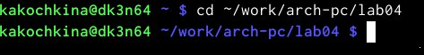

---
## Front matter
title: "Отчёта по лабораторной работе №4"
subtitle: "Создание и процесс обработки программ на языке ассемблера NASM"
author: "Кочкина Кристина Андреевна НММбд-02-23"

## Generic otions
lang: ru-RU
toc-title: "Содержание"

## Bibliography
bibliography: bib/cite.bib
csl: pandoc/csl/gost-r-7-0-5-2008-numeric.csl

## Pdf output format
toc: true # Table of contents
toc-depth: 2
lof: true # List of figures
fontsize: 12pt
linestretch: 1.5
papersize: a4
documentclass: scrreprt
## I18n polyglossia
polyglossia-lang:
  name: russian
  options:
	- spelling=modern
	- babelshorthands=true
polyglossia-otherlangs:
  name: english
## I18n babel
babel-lang: russian
babel-otherlangs: english
## Fonts
mainfont: PT Serif
romanfont: PT Serif
sansfont: PT Sans
monofont: PT Mono
mainfontoptions: Ligatures=TeX
romanfontoptions: Ligatures=TeX
sansfontoptions: Ligatures=TeX,Scale=MatchLowercase
monofontoptions: Scale=MatchLowercase,Scale=0.9
## Biblatex
biblatex: true
biblio-style: "gost-numeric"
biblatexoptions:
  - parentracker=true
  - backend=biber
  - hyperref=auto
  - language=auto
  - autolang=other*
  - citestyle=gost-numeric
## Pandoc-crossref LaTeX customization
figureTitle: "Рис."
tableTitle: "Таблица"
listingTitle: "Листинг"
lofTitle: "Список иллюстраций"
lolTitle: "Листинги"
## Misc options
indent: true
header-includes:
  - \usepackage{indentfirst}
  - \usepackage{float} # keep figures where there are in the text
  - \floatplacement{figure}{H} # keep figures where there are in the text
---

# Цель работы

Освоить процедуры компиляции, познакомиться с языком ассемблера NASM.

# Задание

Написать 2 программы(Hello world и lab4(Имя Фамилия))

# Выполнение лабораторной работы

## Программа Hello world!

Создаем каталог для работы с программами на языке ассемблера NASM (рис. @fig:001).

{#fig:001 width=70%}

Переходим в  созданный каталог (рис. @fig:002).

{#fig:002 width=70%}

Создаем текстовый файл (рис. @fig:003).

{#fig:003 width=70%}

Открываем данный файл в текстовом редакторе (рис. @fig:004).

{#fig:004 width=70%}

{#fig:005 width=70%}

## Транаслятор NASM

Преобразуем текст программы в объектный код (рис. @fig:006).

{#fig:006 width=70%}

## Расширенный синтаксис командной строки NASM

Компилируем исходный файл (рис. @fig:007).

{#fig:007 width=70%}

## Компоновщик LD

Передаем объектный файл на обработку компоновщику (рис. @fig:008).

{#fig:008 width=70%}

Передаем объектный файл на обработку компоновщику (рис. @fig:009).

{#fig:009 width=70%}

## Запуск исполняемого файла

Запускаем на выполнение созданный исполняемый файл (рис. @fig:010).

{#fig:010 width=70%}

## Задание для самостоятельной работы

Создаем копию файла hello.asm (рис. @fig:011).

{#fig:011 width=70%}

Открываем файл и редактируем его (рис. @fig:012).

{#fig:012 width=70%}

Прописывем те же команды, что и с первой программой.

Запускаем команду (рис. @fig:013).

{#fig:013 width=70%}

Копируем файлы в локальный репозиторий (рис. @fig:014).

{#fig:014 width=70%}

Переходим в каталог лабораторных работ и загружаем файлы на Github.

# Выводы

Мы познакомились с языком ассемблера NASM и создали две работающих программы.
